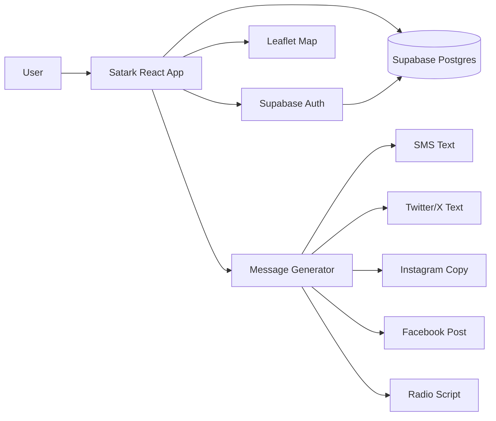
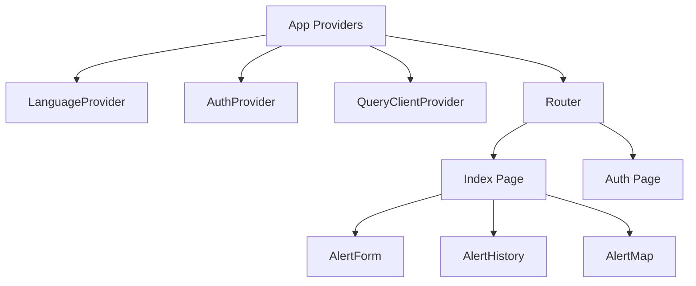
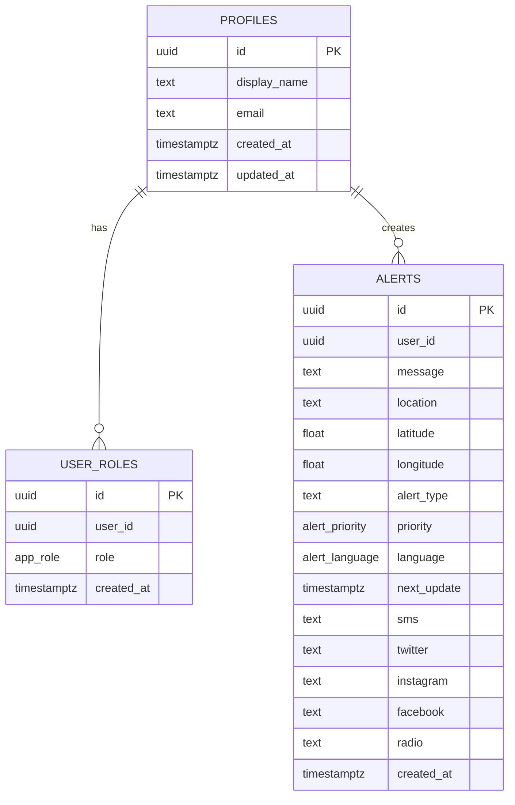
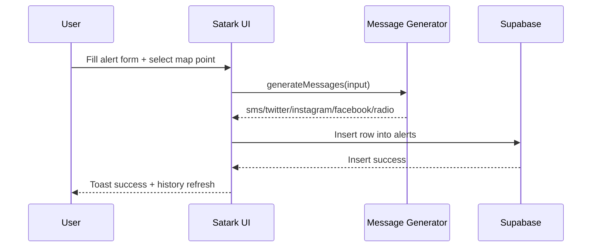
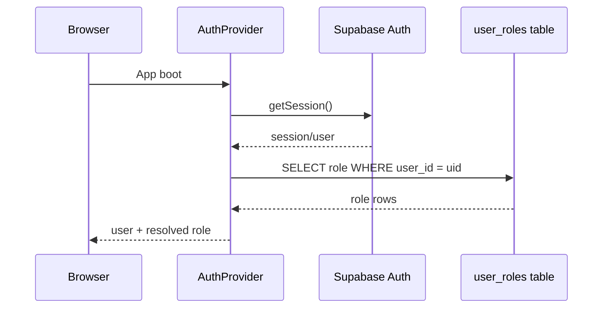

# Satark

Satark is a multilingual, role-aware emergency communication platform that creates one source alert and transforms it into channel-specific messages for SMS, Twitter/X, Instagram, Facebook, and radio scripts.

It is built with React + Vite on the frontend and Supabase for authentication, authorization, and persistence.

## Table of Contents

1. [Overview](#overview)
2. [Detailed Project Concept](#detailed-project-concept)
3. [Key Features](#key-features)
4. [Technology Stack](#technology-stack)
5. [Architecture](#architecture)
6. [Data Model](#data-model)
7. [Project Structure](#project-structure)
8. [Application Flows](#application-flows)
9. [Setup and Installation](#setup-and-installation)
10. [Environment Variables](#environment-variables)
11. [Run, Build, and Test](#run-build-and-test)
12. [Authorization and Security](#authorization-and-security)
13. [Message Generation Rules](#message-generation-rules)
14. [Internationalization](#internationalization)
15. [Map and Geolocation](#map-and-geolocation)
16. [Troubleshooting](#troubleshooting)
17. [Roadmap](#roadmap)

## Overview

Satark solves a common disaster-response problem: the same alert needs to be communicated consistently across multiple channels, but each channel has different format constraints.

This project provides:

- Authenticated alert authoring
- Role-aware moderation actions (admin/user)
- Multi-language support (English, Hindi, Marathi)
- Auto-generated channel variants from one canonical message
- Location-aware alerting using interactive map selection
- Alert history with filtering, search, channel tabbing, copy, and delete actions

## Detailed Project Concept

Satark is designed as a "single-source, multi-destination" emergency communication system.
The core concept is that responders should write one verified alert once, then let the system adapt it for each communication channel without changing the underlying meaning.

### Why this concept matters

During emergencies, communication errors happen when teams manually rewrite alerts for each platform.
Satark reduces this operational risk by separating:

- Canonical alert intent (what happened, where, severity, what people should do)
- Channel expression (how that same intent is worded for SMS, social posts, and radio)

This keeps messaging consistent while still respecting technical constraints like tweet length or radio-script tone.

### Primary users and roles

- Field operators: create alerts quickly from structured form inputs and map coordinates
- Control-room communicators: review generated channel text before external publishing
- Admins: enforce operational governance (role control, destructive actions, history cleanup)

### End-to-end concept flow

1. Situation intake: operator enters message, alert type, priority, language, and location.
2. Canonical structuring: this input becomes one durable base alert payload.
3. Channel adaptation: message generator produces SMS, Twitter/X, Instagram, Facebook, and radio variants.
4. Persistence and auditability: all variants and metadata are stored together in Supabase.
5. Operational retrieval: teams search history, copy channel text, and reuse proven communication patterns.

### Product principles implemented in this project

- Consistency first: all channels derive from one source alert
- Localization by default: the same workflow supports English, Hindi, and Marathi
- Geographic clarity: map-selected coordinates minimize ambiguity in affected areas
- Safe operations: auth, roles, and RLS policies prevent unauthorized modifications
- Human-in-the-loop: generated content assists operators rather than bypassing decision-making

### What this repository demonstrates

This repository represents the core command-center experience, not a full dispatch backend.
It includes authoring, generation, and persistence workflows with role-aware controls.
External publishing connectors (actual SMS gateway/social APIs/radio playout integration) are intentionally listed as roadmap items, so teams can plug in provider-specific dispatch later.

## Key Features

| Feature | Description | Implementation |
|---|---|---|
| Multi-channel generation | Creates SMS, Twitter/X, Instagram, Facebook, and radio text from one input | [src/lib/messageGenerator.ts](src/lib/messageGenerator.ts) |
| Interactive geolocation | Select coordinates from map click and attach to alert | [src/components/AlertMap.tsx](src/components/AlertMap.tsx) |
| Alert history and operations | Search, type filter, copy channel text, per-alert delete, admin clear-all | [src/components/AlertHistory.tsx](src/components/AlertHistory.tsx) |
| Role-based behavior | User/admin role resolution and guarded destructive operations | [src/hooks/useAuth.tsx](src/hooks/useAuth.tsx) |
| Internationalization | Runtime language switch for UI labels and generated messages | [src/lib/translations.ts](src/lib/translations.ts) |
| Authenticated persistence | Supabase Auth + RLS-protected Postgres tables | [supabase/migrations/20260423140809_2580abcf-e418-4335-b170-d16326dc9fa7.sql](supabase/migrations/20260423140809_2580abcf-e418-4335-b170-d16326dc9fa7.sql) |

## Technology Stack

| Layer | Tech |
|---|---|
| Frontend framework | React 18 + TypeScript |
| Build and dev server | Vite 5 |
| Routing | React Router v6 |
| Data fetching cache | TanStack Query |
| UI primitives | Radix UI + custom components |
| Styling | Tailwind CSS + design tokens in HSL |
| Maps | Leaflet + React Leaflet |
| Backend services | Supabase (Auth + Postgres + RLS) |
| Testing | Vitest + Testing Library |
| Linting | ESLint + typescript-eslint |

## Architecture



### Frontend composition



## Data Model

### Core entities

| Table | Purpose | Important Fields |
|---|---|---|
| `profiles` | User profile mirror of auth metadata | `id`, `display_name`, `email`, `created_at`, `updated_at` |
| `user_roles` | Role assignments (`admin`/`user`) | `user_id`, `role`, `created_at` |
| `alerts` | Canonical + channelized alert record | `message`, `location`, `latitude`, `longitude`, `alert_type`, `priority`, `language`, channel columns |

### Alerts table fields (application-facing)

| Field | Type | Notes |
|---|---|---|
| `id` | UUID | Primary key |
| `user_id` | UUID | Creator, FK to `auth.users` |
| `message` | text | Base input message |
| `location` | text | Human-readable location |
| `latitude` / `longitude` | double precision | Coordinates from map click |
| `alert_type` | text | Example: Flood, Fire, Cyclone |
| `priority` | enum | `normal` or `emergency` |
| `language` | enum | `en`, `hi`, `mr` |
| `next_update` | timestamptz nullable | Optional follow-up schedule |
| `sms` / `twitter` / `instagram` / `facebook` / `radio` | text nullable | Generated channel variants |
| `created_at` | timestamptz | Creation timestamp |

### Entity relationship diagram



## Project Structure

| Path | Purpose |
|---|---|
| [src/pages/Index.tsx](src/pages/Index.tsx) | Main authenticated workspace with form, history, map |
| [src/pages/Auth.tsx](src/pages/Auth.tsx) | Sign in / sign up entry page |
| [src/components/AlertForm.tsx](src/components/AlertForm.tsx) | Alert creation UI + save flow |
| [src/components/AlertHistory.tsx](src/components/AlertHistory.tsx) | Alert listing + channel tabs + admin actions |
| [src/components/AlertMap.tsx](src/components/AlertMap.tsx) | Leaflet map selection and alert marker visualization |
| [src/hooks/useAuth.tsx](src/hooks/useAuth.tsx) | Session and role context provider |
| [src/hooks/useLanguage.tsx](src/hooks/useLanguage.tsx) | i18n state and translation helper |
| [src/lib/messageGenerator.ts](src/lib/messageGenerator.ts) | Platform-specific message template engine |
| [src/lib/translations.ts](src/lib/translations.ts) | UI dictionary + language labels |
| [src/integrations/supabase/client.ts](src/integrations/supabase/client.ts) | Supabase browser client |
| [supabase/migrations/20260423140809_2580abcf-e418-4335-b170-d16326dc9fa7.sql](supabase/migrations/20260423140809_2580abcf-e418-4335-b170-d16326dc9fa7.sql) | DB schema, RLS, triggers |

## Application Flows

### Alert creation and distribution flow



### Auth and role resolution



## Setup and Installation

### Prerequisites

- Node.js 18+
- npm 9+
- Supabase project with URL and publishable key

### 1) Clone and enter project

```bash
git clone <your-repository-url>
cd alert-stream-53-main
```

### 2) Install dependencies

```bash
npm install
```

### 3) Configure environment

Create `.env` with values similar to:

```bash
VITE_SUPABASE_URL=https://<your-project-ref>.supabase.co
VITE_SUPABASE_PUBLISHABLE_KEY=<your-anon-publishable-key>
```

### 4) Run development server

```bash
npm run dev
```

## Environment Variables

| Variable | Required | Description |
|---|---|---|
| `VITE_SUPABASE_URL` | Yes | Supabase project URL |
| `VITE_SUPABASE_PUBLISHABLE_KEY` | Yes | Supabase publishable (anon) key for client auth |

## Run, Build, and Test

| Command | Purpose |
|---|---|
| `npm run dev` | Start local Vite dev server |
| `npm run build` | Create production build |
| `npm run build:dev` | Build using development mode |
| `npm run preview` | Preview built output |
| `npm run lint` | Run ESLint checks |
| `npm run test` | Run Vitest suite once |
| `npm run test:watch` | Run Vitest in watch mode |

## Authorization and Security

Satark uses Supabase row-level security policies to enforce access control:

| Operation | Policy summary |
|---|---|
| Read alerts | Any authenticated user can view |
| Create alerts | User can insert only own `user_id` |
| Update/Delete alerts | Owner or admin |
| Manage roles | Admin only |

Security helpers and policies are defined in [supabase/migrations/20260423140809_2580abcf-e418-4335-b170-d16326dc9fa7.sql](supabase/migrations/20260423140809_2580abcf-e418-4335-b170-d16326dc9fa7.sql).

## Message Generation Rules

The generator enforces channel constraints while preserving semantic consistency:

| Channel | Style | Key rule |
|---|---|---|
| SMS | Compact plain text | Truncated if too long |
| Twitter/X | Short + hashtags | Kept under 280 chars |
| Instagram | Visual multiline | Includes hashtags and emoji |
| Facebook | Long-form narrative | Includes official advisory sign-off |
| Radio | Presenter script | Broadcast phrasing with safety tone |

Implementation is in [src/lib/messageGenerator.ts](src/lib/messageGenerator.ts).

## Internationalization

- Supported UI languages: English (`en`), Hindi (`hi`), Marathi (`mr`)
- Language preference persists in `localStorage` key `cas-lang`
- Dictionaries live in [src/lib/translations.ts](src/lib/translations.ts)

## Map and Geolocation

Satark map behavior:

- Click map to set alert coordinates for submission
- Automatically centers on latest alert when available
- Shows selected point, user location (when permitted), and all alert markers
- Uses custom marker visuals for `normal` vs `emergency`

Implementation is in [src/components/AlertMap.tsx](src/components/AlertMap.tsx).

## Troubleshooting

| Problem | Possible cause | Suggested fix |
|---|---|---|
| `vite is not recognized` | Incomplete or corrupted install | Delete `node_modules` and lockfile, then reinstall |
| `Failed to load native binding` | Native package issue on local environment | Ensure clean reinstall on stable local filesystem |
| Supabase auth works but no role badge | Missing `user_roles` seed/trigger issue | Verify migration triggers and role rows |
| No map tiles | Network or tile server restrictions | Check OpenStreetMap tile access from your network |

## Roadmap

| Priority | Item |
|---|---|
| High | Add integration tests for auth + alert workflows |
| High | Add backend dispatch connectors (actual SMS/social publishing) |
| Medium | Add alert status lifecycle (`draft`, `published`, `archived`) |
| Medium | Add audit logs for admin role changes and mass delete |
| Medium | Add geofencing and region filters |

---

If you are extending Satark, start with [src/pages/Index.tsx](src/pages/Index.tsx), [src/components/AlertForm.tsx](src/components/AlertForm.tsx), and [src/lib/messageGenerator.ts](src/lib/messageGenerator.ts). Those files represent the core user and data flow.
